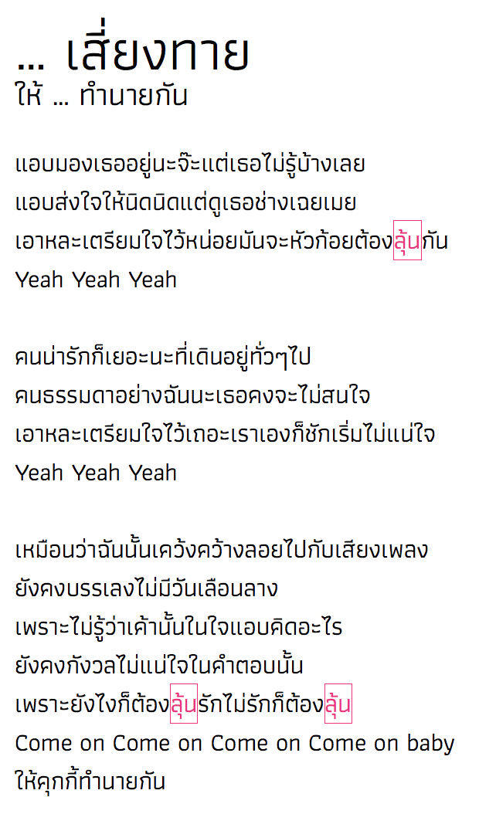

# Fill-in-the-Blank Lyric

Changing one word in a song lyric will also change all other occurrences of that word. This is inspired by a Twitter thread that crowdsourced an updated version of Koisuru Fortune Cookie (คุกกี้เสี่ยงทาย in Thai) to mock Bangkok taxi service.

You can try it at http://puripant.ruchikachorn.com/fill-in-the-blank-lyric/

